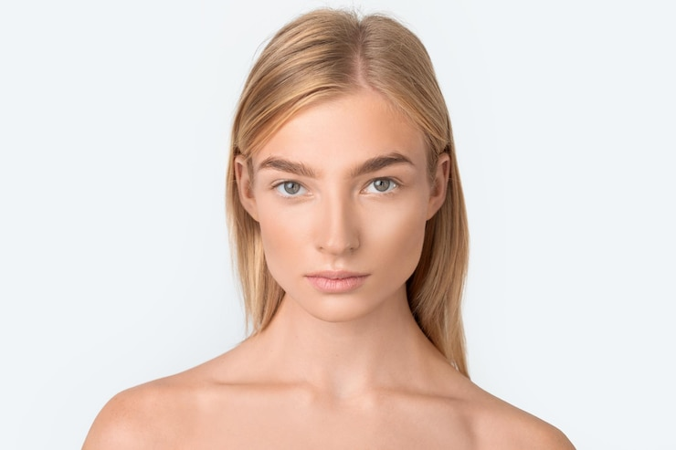
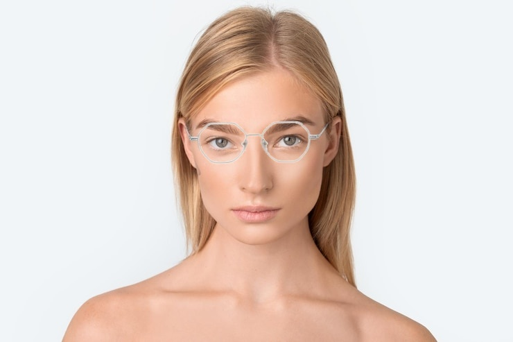

# Virtual Glasses Try-On

Прототип виртуальной примерочной очков по фотографии. Проект разделён на два
этапа: детерминированная 2D-посадка оправы по landmark-точкам лица и опциональная
диффузионная доработка границ, теней и бликов.

## Пример

| Вход | Геометрическая примерка | Диффузионная доработка дужек |
|---|---|---|
|  |  |  |

## Пайплайн

### 1. Геометрическая примерка

`glasses_tryon.py`:

- находит 478 landmark-точек через MediaPipe Face Landmarker;
- оценивает масштаб по межзрачковому расстоянию с эталоном 63 мм;
- учитывает заданные физические размеры моста, линз, дужек и оправы;
- подбирает пару симметричных опорных точек и угол оправы;
- может использовать `scikit-fmm` для приближённой геодезической метрики;
- извлекает очки с белого фона, а для сложного фона может применять `rembg`;
- выполняет афинное преобразование и alpha blending.

### 2. Диффузионная доработка

`diffusion_refine.py` строит inpainting-маску по разнице между исходным фото и
геометрической композицией. Доступны режимы:

- `glasses` — оправа и области линз;
- `frame_only` — только контур оправы;
- `full_face` — область лица;
- `temples_only` — только дужки.

CLI по умолчанию использует `black-forest-labs/FLUX.1-Fill-dev`. Для него может
потребоваться принятие условий модели и авторизация в Hugging Face.

## Установка

Для геометрической стадии:

```bash
python3 -m venv .venv
source .venv/bin/activate
pip install -r requirements.txt
```

Для диффузионной доработки:

```bash
pip install -r requirements-diffusion.txt
hf auth login
```

Нейросетевое удаление фона у каталожного фото очков опционально:

```bash
pip install -r requirements-optional.txt
```

## Запуск

Геометрическая стадия на включённых примерах:

```bash
python glasses_tryon.py \
  --face examples/input/face.jpg \
  --glasses examples/input/glasses.jpg \
  --out result.jpg \
  --bridge 18 --temple 135 \
  --lens-width 52 --lens-height 44 --frame-width 129
```

Диффузионная стадия:

```bash
python diffusion_refine.py \
  --original examples/input/face.jpg \
  --composed result.jpg \
  --out result_refined.jpg \
  --mode temples_only --low-vram
```

Флаг `--all` запускает все четыре режима маски.

## Ограничения

- Масштаб оценивается по среднему IPD 63 мм, а не по индивидуальной калибровке.
- Геометрия основана на 2D-афинном преобразовании и хуже работает при сильном повороте головы.
- Нужны фронтальное фото, одно распознаваемое лицо и разумное освещение.
- Размеры оправы нужно передавать для каждой новой модели очков.
- Диффузионная модель может изменять черты лица и детали оправы; режим `frame_only`
  минимизирует, но не исключает этот риск.
- Качество проверялось визуально на ограниченном наборе примеров; количественный benchmark не проводился.

## Структура

```text
glasses_tryon.py                           # MediaPipe + геометрия + alpha blending
diffusion_refine.py                        # inpainting-маски и FLUX-доработка
face_landmarker_v2_with_blendshapes.task   # MediaPipe Face Landmarker
examples/                                  # входы и выбранные результаты
```
